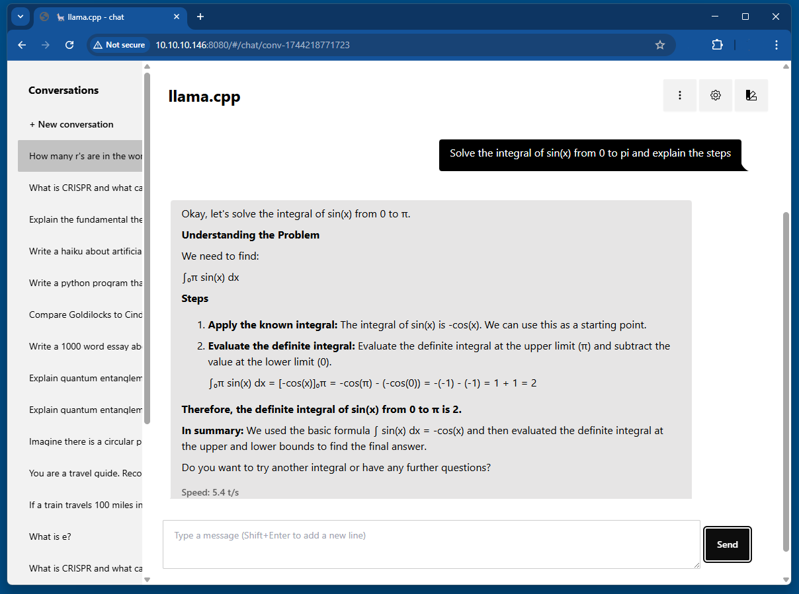

# llama.cpp-jetson.nano


Install a CUDA version of `llama.cpp`, `llama-server` and `llama-bench` on the Jetson Nano, compiled with gcc 8.5. Just type:

``` sh
curl -fsSL https://kreier.github.io/llama.cpp-jetson.nano/install.sh | sh
```

There is also a variant compiled with gcc 9.4 that works. Details are [described here](#running-with-gcc-94). Try it with:

``` sh
curl -fsSL https://kreier.github.io/llama.cpp-jetson.nano/install9.sh | sh
```

If the path is not automatically adjusted, run `export LD_LIBRARY_PATH=/usr/local/lib:$LD_LIBRARY_PATH` or add this line permanently with `nano ~/.bashrc` to the end.

## CLI and Webinterface

Now you can start Gemma3. The first startup takes almost **7 minutes**, later its just 10 seconds. To start enter

``` sh
llama-cli -hf ggml-org/gemma-3-1b-it-GGUF --n-gpu-layers 99
```

The download might be 30 seconds. Then `main: load model the model and apply lora adapter, if any` stops for 6min30 during the first start. The next time the cli is available after **10 seconds**.

If you `ssh` into your Jetson Nano with `ssh 192.168.37.37` you can also start the little `llama-server`. It renders the created markdown much nicer:

``` sh
llama-server -m ~/.cache/llama.cpp/ggml-org_gemma-3-1b-it-GGUF_gemma-3-1b-it-Q4_K_M.gguf --host 0.0.0.0 --n-gpu-layers 99
```

Then open port 8080 on your Jetson with [http://192.168.37.37:8080](http://192.168.37.37:8080) and enjoy the GUI!



Maybe let it compare *Snow White* to *Cinderella*.

## Source

The binaries were compiled with `gcc 8.5` and some changes, described in the repository [https://github.com/kreier/llama.cpp-jetson](https://github.com/kreier/llama.cpp-jetson). The compiled 71 binaries and libraries of the `/build/bin` folder can be found in the `/bin` folder of this repository. 

## Description

The script copies three binaries to `/usr/local/bin` and five libraries to `/usr/local/lib`. They should be included an $PATH and autmatically work. List of binaries to copy:

- llama.cpp
- llama-server
- llama-bench

And the 5 required libraries copied to `/usr/local/lib`:

- libllama.so
- libggml.so
- libggml-base.so
- libggml-cpu.so
- libggml-cuda.so

This is the content of the script:

``` sh
#!/bin/sh

set -eu

red="$( (/usr/bin/tput bold || :; /usr/bin/tput setaf 1 || :) 2>&-)"
plain="$( (/usr/bin/tput sgr0 || :) 2>&-)"

status() { echo ">>> $*" >&2; }
error() { echo "${red}ERROR:${plain} $*"; exit 1; }
warning() { echo "${red}WARNING:${plain} $*"; }

TEMP_DIR=$(mktemp -d)
cleanup() { rm -rf $TEMP_DIR; }
trap cleanup EXIT

available() { command -v $1 >/dev/null; }
require() {
    local MISSING=''
    for TOOL in $*; do
        if ! available $TOOL; then
            MISSING="$MISSING $TOOL"
        fi
    done

    echo $MISSING
}

SUDO=
if [ "$(id -u)" -ne 0 ]; then
    # Running as root, no need for sudo
    if ! available sudo; then
        error "This script requires superuser permissions. Please re-run as root."
    fi

    SUDO="sudo"
fi

NEEDS=$(require curl awk grep sed tee xargs)
if [ -n "$NEEDS" ]; then
    status "ERROR: The following tools are required but missing:"
    for NEED in $NEEDS; do
        echo "  - $NEED"
    done
    exit 1
fi

status "Downloading binaries to temporary directory"

FILES="llama-cli llama-server llama-bench libllama.so libggml.so libggml-base.so libggml-cpu.so libggml-cuda.so"

for FILE in $FILES; do
    status "Downloading $FILE"
    curl -fsSL -o "$TEMP_DIR/$FILE" "https://kreier.github.io/llama.cpp-jetson.nano/bin/$FILE"
done

status "Installing llama.cpp with CUDA support on the Jetson Nano to /usr/local/bin"

$SUDO install -o0 -g0 -m755 -d "/usr/local/bin"
$SUDO install -o0 -g0 -m755 -d "/usr/local/lib"

# Copy binaries
BINARIES="llama-cli llama-server llama-bench"
for FILE in $BINARIES; do
    $SUDO cp -v "$TEMP_DIR/$FILE" /usr/local/bin/
    $SUDO chmod +x /usr/local/bin/$FILE
done

# Copy libraries
LIBRARIES="libllama.so libggml.so libggml-base.so libggml-cpu.so libggml-cuda.so"
for FILE in $LIBRARIES; do
    $SUDO cp -v "$TEMP_DIR/$FILE" /usr/local/lib/
done

# Define the library path
LIB_PATH="/usr/local/lib"

# Check if the LD_LIBRARY_PATH line already exists in ~/.bashrc
grep -q "export LD_LIBRARY_PATH=$LIB_PATH:\$LD_LIBRARY_PATH" ~/.bashrc

# If not, append it to ~/.bashrc
if [ $? -ne 0 ]; then
    echo "Adding library path to ~/.bashrc..."
    echo "export LD_LIBRARY_PATH=$LIB_PATH:\$LD_LIBRARY_PATH" >> ~/.bashrc
else
    echo "Library path is already set in ~/.bashrc."
fi

# Reload ~/.bashrc to apply the changes
echo "Reloading ~/.bashrc..."
source ~/.bashrc

echo "Done! The library path has been updated."

```

## Running with GCC 9.4

Both the original gcc 7.5 and the last supported gcc for nvcc, 8.5, come with the library `libstdc++ 6.0.25` in `/usr/lib/aarch64-linux-gnu/libstdc++.so.6.0.25` 

For gcc 9 this is updated to version `6.0.32`. This is the reason the compiled binary from gcc 9.4 does not work on the unpatched system. Just copying the newer library to the library folder causes a system crash. But you can install gcc 9.4 from a reference repository in 4 minutes:

``` sh
sudo apt install build-essential software-properties-common manpages-dev -y
sudo add-apt-repository ppa:ubuntu-toolchain-r/test -y
sudo apt update
sudo apt install gcc-9 g++-9 -y
sudo update-alternatives --install /usr/bin/gcc gcc /usr/bin/gcc-9 9
sudo update-alternatives --install /usr/bin/g++ g++ /usr/bin/g++-9 9
```

After that you can use `llama.cpp` binaries compiled with gcc 9.4.
